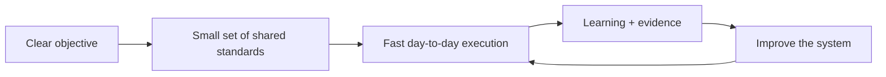

# Minimum Viable Operating System

## Enough structure to scale. Not enough process to slow the work.

My operating philosophy is not process for process's sake.

High-performing growth teams need a small amount of shared structure so people can move quickly without repeatedly renegotiating the basics: what the objective is, how work moves from planning into execution, which signals matter, who owns the decision, and how learning gets carried forward.

The objective is **trustworthy execution at speed**.

## The balance

Too little structure creates friction:

- teams recreate the same decisions;
- taxonomy and measurement drift;
- agencies and internal teams interpret direction differently;
- reporting becomes descriptive rather than actionable;
- learning disappears between planning cycles;
- execution depends on individual heroics.

Too much structure creates a different failure:

- approval chains;
- documentation nobody uses;
- meetings that exist to service the process;
- control layers detached from actual risk;
- slower execution;
- teams optimizing for compliance instead of outcomes.

The useful middle is a **minimum viable operating system**: the smallest set of standards, routines, decision rights, and feedback loops that lets the organization operate with confidence.

## What deserves a standard

Standardize the things that are expensive to rediscover or dangerous to let drift:

1. business objective and success measures;
2. measurement and taxonomy;
3. planning assumptions and decision thresholds;
4. ownership and escalation;
5. QA for consequential execution;
6. test-and-learn discipline;
7. the feedback loop that carries learning into the next brief and plan.

Everything else should earn its complexity.

## Full-cycle learning

The companion [Full-Cycle Growth Loop](https://github.com/silvermanjared-web/marketing-ops-playbooks/blob/main/frameworks/full-cycle-growth-loop.md) shows the operating rhythm:

**Brief → Plan → Execute → Test & Learn → Report & Diagnose → Feed Learning Forward → Better Brief**

The loop provides continuity without dictating exactly how every organization must work. The foundation is repeatable. The implementation adapts to the organization's maturity, channel mix, data, teams, tools, and constraints.

## AI follows the same rule

The same philosophy applies to AI systems.

Use explicit capabilities, bounded mutation, receipts, and security controls where they reduce real risk. Do not build approval machinery around ordinary low-risk work simply because the system uses AI.

The [AI Operating System Reference](../04-ai-systems/ai-operating-system-reference/README.md) applies this principle technically: enough governance for safe autonomy, no more than necessary.

## Standard

A good operating system should make the team feel **less** process-bound, not more.

If the system is working, people spend less time figuring out how work should happen and more time doing the work, learning from it, and improving the next decision.
