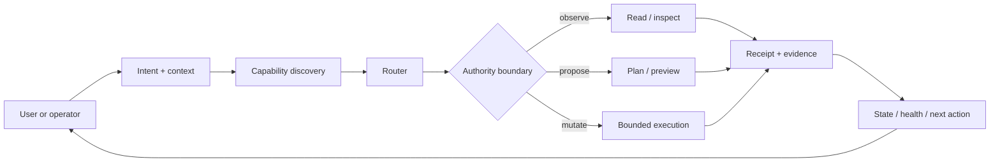

# AI Operating System Reference

**A public-safe reference architecture for turning AI from a chat interface into an operating layer.**

This package distills patterns developed through larger private operating-system work into a small, inspectable reference. It does not expose private systems, personal data, private integrations, credentials, or environment-specific infrastructure. It shows the reusable architecture: context, capabilities, bounded execution, receipts, state, health, and human authority.

## Five-minute proof

Run:

```bash
cd 04-ai-systems/ai-operating-system-reference
npm test
```

The proof path executes smoke, unit, and security tests against the reference runtime.

Then inspect:

1. `tools/reference_runtime.py` — capability discovery and bounded execution.
2. `templates/capability-contract.json` — a portable capability contract.
3. `templates/receipt.schema.json` — the evidence contract returned after execution.
4. `docs/bounded-execution.md` — why mutation is explicit and narrow.
5. `references/interoperability.md` — how clients such as ChatGPT, Claude, CLI tools, or MCP-compatible surfaces can consume the same contract.

## Selected evidence

| Question | Evidence |
|---|---|
| Can the system expose what it can actually do? | `discover()` returns an explicit capability registry. |
| Can it separate observation from mutation? | Capabilities declare `effect=read` or `effect=write`. |
| Can mutation remain bounded? | Write capabilities require explicit authority and constrained arguments. |
| Can execution be audited? | Every execution returns a structured receipt. |
| Can multiple AI clients share one operating contract? | The client boundary is described independently from any single model vendor. |
| Can the reference fail safely? | Unknown capabilities, missing confirmation, and unsafe paths are refused. |

## What I built

The reference models an AI operating layer as six cooperating concerns:

- **Context** — what the system knows and which source is authoritative.
- **Capabilities** — what the system can actually do.
- **Routing** — how intent maps to a permitted capability.
- **Authority** — whether a capability may observe, propose, or mutate.
- **Execution** — the bounded work itself.
- **Evidence** — receipts, health, and state that make outcomes inspectable.



## Core point of view

AI systems become useful when they can do ordinary work reliably without becoming opaque or over-governed.

The design standard is:

- simplify first;
- make the basic path work end to end;
- expose real capabilities instead of implied abilities;
- let admitted owners execute ordinary work without repeated permission loops;
- constrain mutation at the capability boundary;
- return evidence after execution;
- build health and cleanup into normal operation;
- add only the minimum governance needed for safe autonomy.

## Signature frameworks

### Observe → Propose → Mutate

1. **Observe**: read state without changing it.
2. **Propose**: calculate or preview the bounded change.
3. **Mutate**: execute only within the declared target and authority.

### Capability contract

Every capability should answer:

- What does it do?
- What inputs are accepted?
- Does it mutate state?
- What authority is required?
- What can it touch?
- What does success return?
- What does refusal look like?

### Receipt contract

Execution is not complete until the system can report:

- capability invoked;
- arguments accepted;
- effect class;
- status;
- what changed or was observed;
- evidence;
- timestamp or run identity;
- refusal reason when applicable.

### Bounded convergence

After a build completes, take cheap deterministic cleanup wins, classify the remainder, then stop. Cleanup is not permission to create a new remediation program.

## Ecosystem map

This reference is the architecture layer behind the public execution repos:

- `marketing-intelligence-agent` applies the model to source-aware growth intelligence and agent routing.
- `marketing-ops-toolkit` applies it to deterministic operational checks and bounded mutation.
- `brand-context-system` applies it to context packaging and AI-assisted design handoff.
- `private-to-public-release-gate` applies it to privacy-safe publication from private canonical systems.
- `growth-architecture-os` connects these technical patterns back to growth leadership and operating leverage.

## How to read this package

If you are evaluating leadership judgment, read this README and `docs/bounded-execution.md`.

If you are evaluating technical depth, inspect `tools/reference_runtime.py`, the templates, and tests.

If you are evaluating AI interoperability, read `references/interoperability.md`, `CHATGPT.md`, and `CLAUDE.md`.

If you are evaluating safety and ownership, read `GOVERNANCE.md`, `SECURITY.md`, and `USAGE.md`.

## Further reading

- [AI Operating Model](../ai-operating-model.md)
- [Agent Workflows](../agent-workflows.md)
- [Governance and Risk](../governance-and-risk.md)
- [Ecosystem Map](../../docs/ecosystem-map.md)

## IP and usage

This package is public for professional review and architectural reference. It is not a distribution of the private systems from which the patterns were learned and is not licensed for commercial reuse, resale, model training, or derivative productization without permission.

See [USAGE.md](USAGE.md).