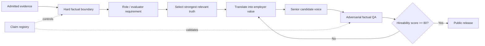

# Positioning Architecture

The evidence layer and positioning layer are deliberately separate.

The evidence layer is conservative because its job is to prevent unsupported claims. The positioning layer is persuasive because its job is to make supported capability legible to an employer.

A strong system needs both. Evidence without positioning becomes a compliance memo. Positioning without evidence becomes marketing fiction.
