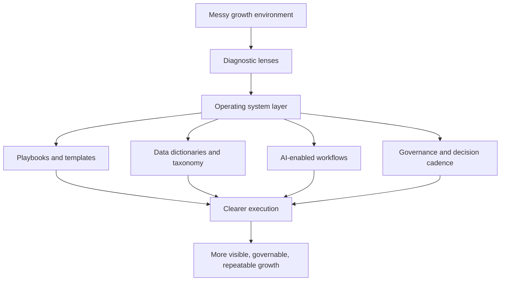
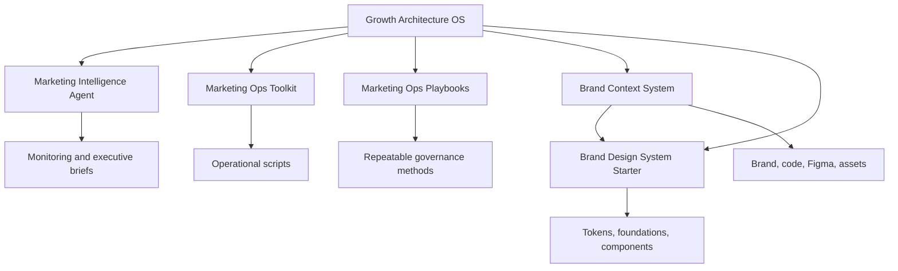

# Growth Architecture OS

**Jared Silverman's public operating system for growth leadership.**

This repository is not a portfolio in the usual sense. It is a structured view of how I think, operate, diagnose growth systems, build decision infrastructure, and turn fragmented marketing environments into something leaders can actually manage.

My work sits at the intersection of performance media, CRO, analytics, marketing operations, agency governance, and AI-enabled workflows. The throughline is simple: **stabilize the system, then scale it.**

## What this repo is

Growth usually does not break because a team lacks tactics. It breaks because the operating model is unclear: spend moves faster than measurement, agencies execute without a shared standard, teams debate reports instead of decisions, and leadership sees risk too late.

This repo documents the system I use to solve that problem.

## Core point of view

I build the operating system underneath growth: the visibility, standards, QA, cadence, and decision logic that make spend easier to manage and performance easier to improve.

## Ecosystem map

Growth Architecture OS is the center of the public portfolio. The supporting repos show how specific parts of the operating system become reusable tools, playbooks, context systems, and implementation layers.

## Repo map

| Folder / File | Purpose |
|---|---|
| `00-positioning/` | Executive narrative, bio, leadership principles, operating style, proof controls |
| `01-case-studies/` | Public-safe case studies from growth, CRO, media, and operating-model work |
| `02-growth-architecture/` | Reusable frameworks for media, CRO, reporting, and agency governance |
| `03-playbooks/` | Practical playbooks for diagnosis, triage, testing, taxonomy, and media correction |
| `04-ai-systems/` | AI-enabled marketing operations, agent workflows, prompt patterns, and risk controls |
| `05-templates/` | Executive-ready templates and meeting guides |
| `06-reference/` | Small reference models for signal quality, outcome logic, and decision support |
| `07-data-dictionaries/` | Shared KPI, funnel, taxonomy, and reporting language |
| `08-brand-and-voice/` | Writing style, personal brand system, and communication rules |
| `09-job-market/` | Private positioning material for role targeting, interview stories, and recruiter conversations |
| `10-thought-leadership/` | Public POV files from articles, platform shifts, and media strategy themes |
| `_meta/` | Content map, source index, and repo metadata |
| `design-system/` | Lightweight visual/token system for future web or portfolio work; intentionally in progress |
| `docs/` | Longer thesis and explanatory articles behind the operating system |
| `GOVERNANCE.md` | Public governance standard for claim discipline, source support, and public safety |
| `proof-points.md` | Root alias for the canonical claim bank in `00-positioning/` |

## Related repos

- [`marketing-intelligence-agent`](https://github.com/silvermanjared-web/marketing-intelligence-agent) — local marketing intelligence, monitoring, risk detection, and briefing workflows.
- [`marketing-ops-toolkit`](https://github.com/silvermanjared-web/marketing-ops-toolkit) — practical automation scripts for marketing operations, audits, reporting, and campaign-health workflows.
- [`marketing-ops-playbooks`](https://github.com/silvermanjared-web/marketing-ops-playbooks) — repeatable playbooks for taxonomy governance, data validation, funnel QA, and performance diagnostics.
- [`brand-context-system`](https://github.com/silvermanjared-web/brand-context-system) — structured context bundle for AI-assisted design and front-end work.
- [`brand-design-system-starter`](https://github.com/silvermanjared-web/brand-design-system-starter) — portable design-system starter for tokens, foundations, components, CSS variables, and AI-assisted handoff.

## Signature frameworks

### The first 90 days

1. **Days 1-30:** Listen hard. Map reality. Find the leaks.
2. **Days 31-60:** Rebuild the layer that makes execution trustworthy.
3. **Days 61-90:** Move from recovery mode to operating rhythm.

By day 90, leadership should know what is working, what is risky, who owns what, and where to invest next.

### Five diagnostic lenses

1. Demand reality
2. Measurement integrity
3. Media allocation
4. Agency and team model
5. Leadership cadence

### Operating pillars

- Operating discipline
- Visibility that drives action
- Governance that improves performance
- Decision-ready communication
- Reusable operating models

## How to read this repo

For a narrative on how this GitHub ecosystem fits together, see [`docs/why-i-run-growth-like-a-platform-team.md`](docs/why-i-run-growth-like-a-platform-team.md).

Start here:

1. `00-positioning/professional-narrative.md`
2. `03-playbooks/first-90-days.md`
3. `01-case-studies/ohdela-cro-roadmap.md`
4. `02-growth-architecture/performance-media-operating-model.md`
5. `04-ai-systems/ai-operating-model.md`

If you are evaluating me for a senior growth, performance marketing, CMO-adjacent, marketing operations, or AI-enabled transformation role, this repo is meant to show the work behind the resume.

## Further reading

- [Why I Run Growth Like a Platform Team](docs/why-i-run-growth-like-a-platform-team.md)

## Review standard

The repo should not sound more certain than the source material. Metrics, titles, case studies, and public-facing summaries should stay grounded in resume, portfolio, deck, article, or source-note support.

## IP and usage

This repository contains Jared Silverman's personal intellectual property, professional positioning, frameworks, templates, and work samples. It is shared for evaluation, collaboration, and professional context. It is not licensed for reuse, resale, training, or commercial adaptation without permission.

© 2026 Jared Silverman. All rights reserved.