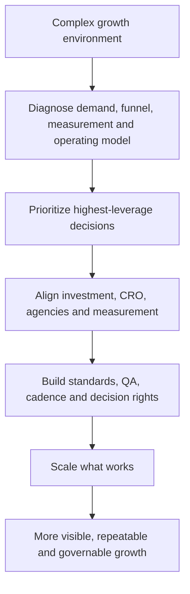

# Growth Architecture OS

**Jared Silverman's public operating system for leading complex growth.**

This repository shows how I diagnose growth systems, allocate investment, rebuild performance, structure agencies and teams, connect marketing signals to business economics, and turn operating knowledge into infrastructure that scales.

My work sits across performance media, CRO, measurement, marketing operations, agency governance, AI-enabled workflows, and executive decision support. The throughline is simple: **make growth legible, make the right decisions faster, then build the system to scale them.**

## Five-minute proof

Do not read the repository front to back. Start with the leadership question you need answered.

| Question | Evidence |
|---|---|
| Can I run a complex growth system? | [`02-growth-architecture/performance-media-operating-model.md`](02-growth-architecture/performance-media-operating-model.md) |
| Can I connect marketing performance to investment and business economics? | [`06-reference/media-metrics-to-financial-outcomes.md`](06-reference/media-metrics-to-financial-outcomes.md) |
| Can I show recent enterprise-scale leadership? | [`01-case-studies/pansophic-growth-system.md`](01-case-studies/pansophic-growth-system.md) |
| Can I rebuild acquisition performance? | [`01-case-studies/wex-app-growth-rebuild.md`](01-case-studies/wex-app-growth-rebuild.md) |
| Can I establish an operating rhythm quickly? | [`03-playbooks/first-90-days.md`](03-playbooks/first-90-days.md) |
| Can I turn AI into operating leverage? | [`04-ai-systems/ai-operating-model.md`](04-ai-systems/ai-operating-model.md) |

### Selected evidence

| Case study | Leadership signal |
|---|---|
| [Multi-Brand Education Growth System](01-case-studies/pansophic-growth-system.md) | $15M+ media scope across 180+ institutions; capital reallocation and channel-allocation testing; multi-factor forecasting; agency RFP/partner selection; in-house capability building across three business units; 150+ landing pages; 60+ campaigns; and deeper-funnel measurement architecture |
| [App Growth Rebuild](01-case-studies/wex-app-growth-rebuild.md) | Approved applications grew ~500% after an end-to-end acquisition rebuild |
| [FFIA Measurement Model](01-case-studies/stand-together-ffia-measurement.md) | 86% YoY growth in web-qualified engagements while outperforming benchmarks by 3x |

## What I build

Growth usually does not break because a team lacks tactics. It breaks because spend, conversion, measurement, agencies, technology, and leadership decisions are operating as separate systems.

I build the operating layer that reconnects them.

That means clearer capital-allocation and forecasting logic, stronger measurement architecture, better agency selection and accountability, deliberate in-housing and capability building, disciplined CRO, explicit decision rights, faster executive visibility, and repeatable workflows that allow teams to move without losing control.

```mermaid
flowchart TD
    A[Complex growth environment] --> B[Diagnose demand, funnel, measurement and operating model]
    B --> C[Prioritize highest-leverage decisions]
    C --> D[Align investment, CRO, agencies and measurement]
    D --> E[Build standards, QA, cadence and decision rights]
    E --> F[Scale what works]
    F --> G[More visible, repeatable and governable growth]
```

## Core point of view

I treat growth as an operating system rather than a collection of channels.

- **Investment:** Spend is capital allocation. The job is to move resources toward the strongest business opportunity, not defend channel budgets.
- **Performance:** Media, CRO, creative, CRM, and downstream outcomes need one decision model.
- **Measurement:** Reporting should change a decision, clarify a risk, or identify what must be learned next.
- **Agencies and teams:** Accountability improves when scope, standards, ownership, escalation, and decision rights are explicit.
- **AI:** AI should compound judgment, monitoring, QA, synthesis, and repeatability rather than create another layer of novelty.
- **Leadership:** Executives need a system that makes tradeoffs visible early enough to act.

## Ecosystem map

Growth Architecture OS is the center of the public portfolio. Supporting repositories show how parts of the operating model become reusable intelligence, tools, playbooks, context systems, and implementation layers.

The [`private-to-public-release-gate`](https://github.com/silvermanjared-web/private-to-public-release-gate) demonstrates the publication-governance layer used to turn private operating context into reviewed public artifacts.

For the portfolio map, see [`docs/ecosystem-map.md`](docs/ecosystem-map.md).

## Repo map

| Folder / File | Purpose |
|---|---|
| `00-positioning/` | Executive narrative, leadership principles, operating style, proof points, and evidence controls |
| `01-case-studies/` | Case studies showing growth, CRO, media, measurement, and operating-model leadership |
| `02-growth-architecture/` | Reusable operating models for media, CRO, reporting, and agency governance |
| `03-playbooks/` | Practical playbooks for diagnosis, triage, testing, taxonomy, and media correction |
| `04-ai-systems/` | AI-enabled marketing operations, agent workflows, prompt patterns, and risk controls |
| `05-templates/` | Executive-ready templates and meeting guides |
| `06-reference/` | Models connecting signal quality, outcomes, financial translation, and decision support |
| `07-data-dictionaries/` | Shared KPI, funnel, taxonomy, and reporting language |
| `08-brand-and-voice/` | Writing style, personal brand system, and communication rules |
| `09-positioning/` | Interview stories, role targeting, and recruiter framing |
| `10-thought-leadership/` | Public POV on platform shifts, media strategy, and leadership themes |
| `docs/` | Portfolio navigation and longer-form operating-system thinking |

## Signature frameworks

### The first 90 days

1. **Days 1-30:** Map reality, establish signal integrity, and identify the highest-cost leaks.
2. **Days 31-60:** Fix the operating layer that makes execution and investment trustworthy.
3. **Days 61-90:** Move from stabilization to a repeatable growth cadence.

By day 90, leadership should know what is working, what is risky, who owns what, where capital should move, and what the organization needs to learn next.

### Five diagnostic lenses

1. Demand reality
2. Measurement integrity
3. Media allocation
4. Agency and team model
5. Leadership cadence

## How to read this repo

Use [`docs/evaluator-paths.md`](docs/evaluator-paths.md) for a role-specific route or start with the five-minute proof above. The repository is designed to show the operating thinking behind the résumé: how I diagnose, prioritize, allocate, govern, communicate, and scale.

The claim system in `00-positioning/claims/` provides the evidence boundary underneath the public narrative. Its job is to preserve factual integrity; the job of the front-door portfolio is to make the leadership value of that evidence clear.

## Further reading

- [Professional Narrative](00-positioning/professional-narrative.md)
- [Evaluator Paths](docs/evaluator-paths.md)
- [Why I Run Growth Like a Platform Team](docs/why-i-run-growth-like-a-platform-team.md)
- [Media Metrics to Financial Outcomes](06-reference/media-metrics-to-financial-outcomes.md)
- [Proof Points](00-positioning/proof-points.md)

## IP and usage

This repository contains Jared Silverman's personal intellectual property, professional positioning, frameworks, templates, and work samples. It is shared for evaluation, collaboration, and professional context. It is not licensed for reuse, resale, training, or commercial adaptation without permission.

Usage and rights: see [USAGE.md](USAGE.md).

© 2026 Jared Silverman. All rights reserved.
