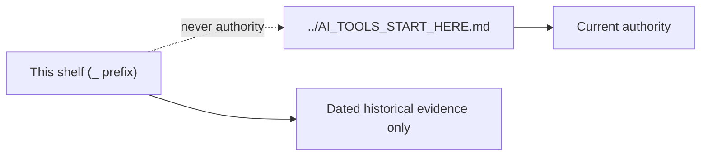

# Public Portfolio Repositories — Archive Shelf Index

```json
{
  "document": "archive-shelf-index",
  "document_status": "non-authoritative",
  "authority_level": "non-authoritative-evidence",
  "machine_readable": true,
  "count_policy": "derived-only",
  "governing": false,
  "authority": "downstream-non-authoritative",
  "classification": "generated-evidence",
  "counts_source": "derived-only",
  "superseded_by": "../AI_TOOLS_START_HERE.md",
  "machine_authority": "control/DOCUMENT_AUTHORITY_REGISTRY.json",
  "platform_maturity_contract": "control/PLATFORM_MATURITY_CONTRACT.json",
  "mutation_authority": "none; retired evidence shelf"
}
```

## Documentation contract

### Purpose

**Nothing in this directory governs.** This shelf is retired, archived, or
generated evidence. It is kept for provenance only.

A populated archive is a trap unless it says so. If you arrived here by search,
by link, or by habit, this index exists to tell you that the contents stopped
governing anything.

### Authority and machine contract

This shelf is **not authoritative**. It is `downstream-non-authoritative` per
`control/DOCUMENT_AUTHORITY_REGISTRY.json` and excluded from canonical checks by
`control/PLATFORM_MATURITY_CONTRACT.json`. Counts are `derived-only`.

**Current authority lives at `../AI_TOOLS_START_HERE.md`.** Go there.

**Nothing in this shelf is a current procedure input.**

### Related documents

- `../AI_TOOLS_START_HERE.md` — current authority for this domain
- `../SHELF_LABELS.md` — why this shelf carries a `_` prefix
- `archive-shelf-contract.json` (home-root-governance) — the rule this index satisfies

### Usage policy and boundaries

- Do **not** cite anything here as current authority.
- Do **not** use anything here as a procedure input.
- Do **not** edit content here to change behaviour. It is read-only history.
- You **may** cite it as dated historical evidence, if you label it as such.

### Trigger words

archive, retired, historical, superseded, evidence, non-authoritative,
deprecated, backup, do not cite, no longer governs, provenance

### Diagram



### FAQ

**Does anything in this directory govern?**

No. Nothing in this directory governs.

**Where is current authority?**

`../AI_TOOLS_START_HERE.md`.

**Is anything here a procedure input?**

No. Nothing in this shelf is a current procedure input.

**Why keep it at all?**

Provenance. Deleting history hides how the system reached its current state.

## Relevant Documents

- `../AI_TOOLS_START_HERE.md`
- `../SHELF_LABELS.md`
- `../README.md`
