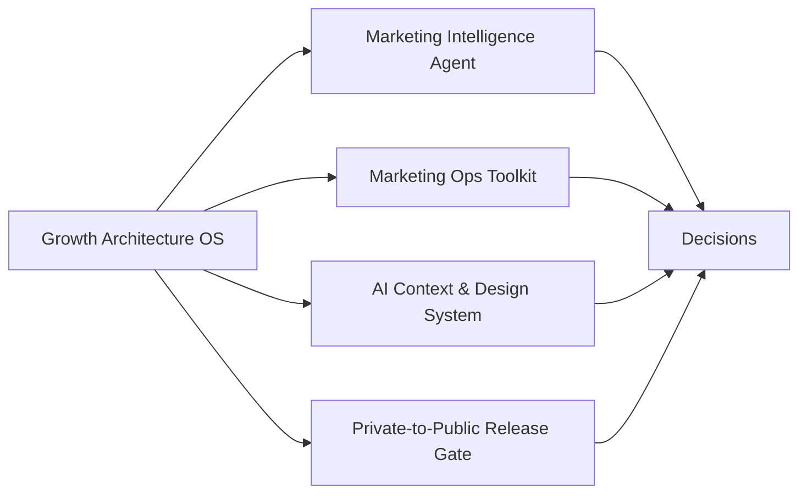

# GitHub Ecosystem Map

The public repositories are one portfolio system, not a collection of unrelated coding exercises.

They show how I move from growth leadership and decision architecture into AI-enabled intelligence, bounded execution, context engineering, and privacy-safe publication.

## System roles

| Repository | Role in the system | What it proves |
|---|---|---|
| `silvermanjared-web` | Profile and front door | Executive narrative, proof routing, and portfolio navigation |
| `growth-architecture-os` | Operating-system hub | Growth leadership, capital allocation, diagnostics, playbooks, and the canonical AI operating-system reference |
| `marketing-intelligence-agent` | Intelligence layer | Source-aware synthesis, capability discovery, modular agent routing, and receipts |
| `marketing-ops-toolkit` | Execution layer | Deterministic checks, platform utilities, and five bounded mutation contracts |
| `marketing-ops-playbooks` | Method layer | Repeatable taxonomy, QA, funnel, governance, and performance-diagnostic playbooks |
| `brand-context-system` | AI context & design layer | Structured source context through reviewed extraction into tokens, CSS, and component contracts |
| `brand-design-system-starter` | Historical implementation reference | Earlier standalone design-system implementation retained for portfolio history |
| `private-to-public-release-gate` | Publication boundary | Privacy scanning, explicit export decisions, allowlisted overlays, and Git-aware drift checks |

## Canonical AI architecture

The shared technical pattern is documented and tested in [AI Operating System Reference](../04-ai-systems/ai-operating-system-reference/README.md).

The architecture is intentionally simple:

1. establish trustworthy context;
2. expose real capabilities;
3. route work to a narrow executor;
4. constrain mutation at the capability boundary;
5. return evidence;
6. preserve human authority where consequence requires it.

## Portfolio logic

The throughline is not “I write code.”

It is: **I design growth operating systems, and I now have enough AI and software capability to build the infrastructure around those systems directly.**

The repositories demonstrate different parts of that thesis:

- business and capital-allocation judgment;
- operating-model design;
- source and measurement discipline;
- AI context engineering;
- agent and client interoperability;
- deterministic automation;
- bounded mutation;
- self-maintaining workflows;
- privacy-safe publication;
- evidence-driven execution.

## Reader paths

- Growth leadership: start in `growth-architecture-os`.
- AI systems: start in [AI Operating System Reference](../04-ai-systems/ai-operating-system-reference/README.md).
- Agentic intelligence: open `marketing-intelligence-agent`.
- Execution architecture: open `marketing-ops-toolkit`.
- Context engineering and design: open `brand-context-system`.
- Technical governance: open `private-to-public-release-gate`.

See [Evaluator Paths](evaluator-paths.md) for role-specific navigation.

## Source-of-truth note

Growth Architecture OS is the canonical relationship map for the public portfolio. Inclusion in the ecosystem does not mean every repository is generated from the same private source. The release gate describes how private-derived publication can be governed when that relationship exists.
