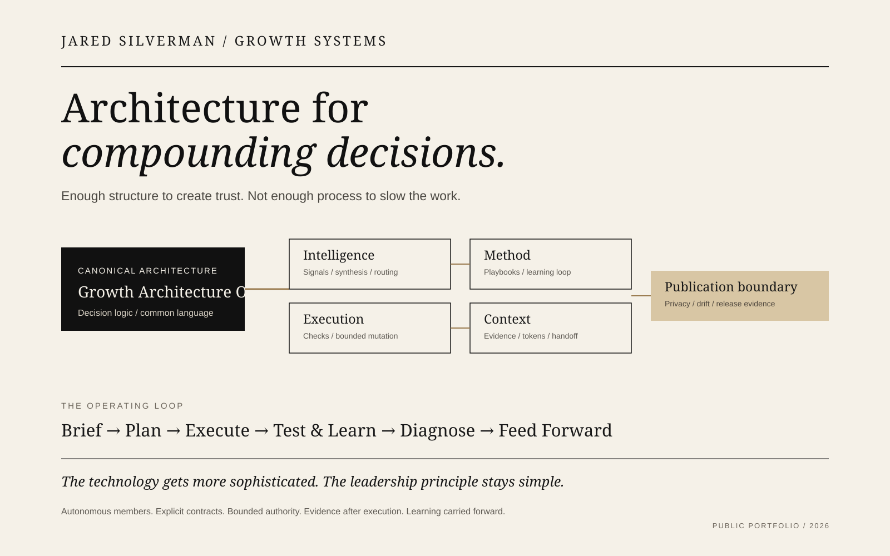

# Executive Portfolio Index

> **The shortest path through the portfolio depends on the question you are trying to answer.**

This index is designed for evaluation, not exhaustive reading.

## If you have 5 minutes

Read these three artifacts:

1. [Growth Architecture OS README](../README.md) — the operating thesis.
2. [Full-Cycle Growth Loop](https://github.com/silvermanjared-web/marketing-ops-playbooks/blob/main/frameworks/full-cycle-growth-loop.md) — how strategy becomes execution, learning, and a better next brief.
3. [AI Operating System Reference](../04-ai-systems/ai-operating-system-reference/README.md) — how the same operating philosophy becomes technical architecture.

**What you should understand:** I build enough structure to make complex growth trustworthy and scalable, then use measurement, learning, automation, and AI to reduce friction around the work.

## If you have 15 minutes

Choose your lens.

| Evaluator | Read | What it answers |
|---|---|---|
| CEO / GM | [Multi-Brand Education Growth System](../01-case-studies/pansophic-growth-system.md) + [Media Metrics to Financial Outcomes](../06-reference/media-metrics-to-financial-outcomes.md) | Can he connect investment to business outcomes and operating decisions? |
| CMO / Growth leader | [Performance Media Operating Model](../02-growth-architecture/performance-media-operating-model.md) + [Full-Cycle Growth Loop](https://github.com/silvermanjared-web/marketing-ops-playbooks/blob/main/frameworks/full-cycle-growth-loop.md) | Can he build a repeatable growth system without burying teams in process? |
| Recruiter / hiring leader | [Proof Ledger](proof-ledger.md) | Are the claims easy to verify and relevant to senior leadership? |
| Technical / AI evaluator | [Capability Catalog](capability-catalog.md) + [AI OS Reference](../04-ai-systems/ai-operating-system-reference/README.md) | Is the AI work architectural and executable rather than prompt theater? |
| Transformation leader | [Federation Status](federation-status.md) + [Architecture Decisions](../architecture-decisions/README.md) | Can he design systems that remain autonomous, governable, and adaptable? |

## If you have 30 minutes

Run one of the [Try the System](../scenarios/README.md) scenarios.

Each scenario has two layers:

- **Jared's reasoning** — how I frame the business problem, separate signal from noise, and decide what matters.
- **System behavior** — how the public operating architecture gathers context, applies methods, routes bounded execution, produces evidence, and carries learning forward.

Then inspect the actual implementation repository used by the scenario.

## The portfolio in one sentence

**Growth Architecture OS is the canonical decision architecture; the federated repositories turn that architecture into methods, intelligence, bounded execution, structured context, and publication-safe evidence.**

## Visual map

## Deep reading

- [Proof Ledger](proof-ledger.md)
- [Capability Catalog](capability-catalog.md)
- [Federation Status](federation-status.md)
- [Private Scale / Public Proof](private-scale-public-proof.md)
- [Architecture Decision Records](../architecture-decisions/README.md)
- [Try the System](../scenarios/README.md)
