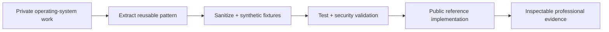

# Private Scale / Public Proof

## What is public

The public portfolio contains inspectable reference implementations, operating frameworks, tests, schemas, case studies, and evidence controls.

It is designed to answer a professional question:

**What can Jared actually reason about, design, and build?**

## What remains private

Larger personal operating-system work remains private because it contains personal data, environment-specific infrastructure, integrations, credentials, local execution surfaces, and implementation details that do not belong in a public portfolio.

The public repositories therefore do **not** attempt to reproduce a private operating environment.

## What crosses the boundary

Reusable patterns can cross the boundary when they are:

1. stripped of personal or confidential data;
2. reduced to the smallest useful reference implementation;
3. made independently understandable;
4. tested with synthetic fixtures;
5. governed by an explicit publication boundary.

Examples include:

- capability discovery;
- bounded mutation;
- execution receipts;
- client interoperability;
- federation contracts;
- self-describing system status;
- context engineering;
- deterministic validation;
- privacy-safe release controls.

## The proof model

Public proof is deliberately narrower than private scale.

That is a feature, not a limitation. A portfolio should expose enough implementation to make capability credible without exposing the environment that produced it.

## Publication boundary

See [Private-to-Public Release Gate](https://github.com/silvermanjared-web/private-to-public-release-gate) for the executable pattern used to reason about private-derived public artifacts.
