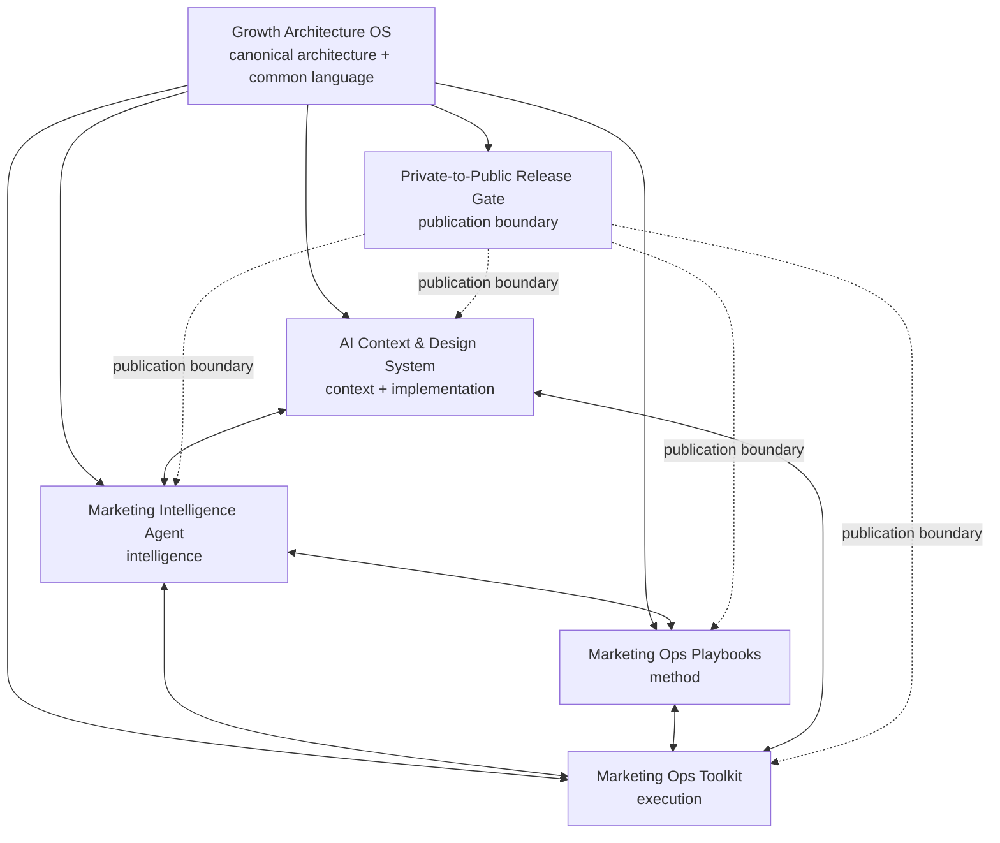

# Public Portfolio Federation

## Purpose

The public repositories operate as a **federation of independently useful systems**.

Growth Architecture OS is the canonical architecture and common-language layer. Supporting repositories remain autonomous in execution while publishing clear interfaces that allow their methods, evidence, and capabilities to reinforce one another.

The objective is interoperability without unnecessary dependency.

## Federation rule

**Canonical architecture → autonomous members → explicit contracts → horizontal interoperability → no ornamental coupling.**

A repository does not become more mature merely because it depends on another repository.

Each member should work independently. Federation becomes useful when a stable output from one member is a meaningful input to another.

The arrows describe compatible operating relationships, not mandatory runtime dependencies.

## Member contract

Every federated member declares:

- **Role** — the distinct problem it owns.
- **Provides** — stable concepts, artifacts, methods, or capabilities other members may use.
- **Consumes** — compatible inputs it can accept when useful.
- **Authority** — what the member owns and what it does not.
- **Independence** — the minimum path that works without another repository.
- **Canonical parent** — Growth Architecture OS for shared architecture and terminology.

Member declarations live in `FEDERATION.md`.

## Members

| Member | Role | Provides |
|---|---|---|
| Growth Architecture OS | Canonical architecture | common language, growth operating philosophy, AI OS reference, decision architecture |
| Marketing Intelligence Agent | Intelligence | source-aware synthesis, signals, routing, receipts |
| Marketing Ops Toolkit | Execution | deterministic checks, bounded mutations, operational receipts |
| Marketing Ops Playbooks | Method | diagnostic methods, full-cycle learning loop, reusable frameworks |
| AI Context & Design System | Context + implementation | structured context, extraction, tokens, component contracts |
| Private-to-Public Release Gate | Publication boundary | privacy scan, export decisions, drift evidence |

## Horizontal examples

### Method → intelligence → execution

A playbook can define the diagnostic method. Marketing Intelligence Agent can synthesize signals against that method. Marketing Ops Toolkit can execute an admitted deterministic operation.

No runtime dependency is required for any of the three to remain useful independently.

### Context → intelligence

Structured context can improve synthesis quality. The Intelligence Agent may consume compatible context artifacts without making the Context & Design System a required dependency.

### Execution → intelligence → learning

A Toolkit receipt can become evidence for an intelligence workflow. The resulting diagnosis can feed the Full-Cycle Growth Loop and improve the next brief or plan.

### Private → public

The Release Gate governs a publication boundary when a public artifact is derived from private canonical work. It does not sit in the runtime path of ordinary public-repo execution.

## Admission standard

A new member belongs in the federation only if it:

1. owns a distinct operating role;
2. is independently useful;
3. exposes a stable artifact, method, or capability;
4. can describe its authority boundary;
5. materially improves the portfolio system;
6. does not duplicate an existing member merely to create another layer.

## Interoperability standard

Prefer, in order:

1. links and common language;
2. documented artifact contracts;
3. machine-readable schemas;
4. thin client adapters;
5. protocol interoperability such as MCP when actual execution benefits.

Do not jump to runtime integration when a document or artifact contract solves the problem.

## Governance

Growth Architecture OS owns shared architecture and terminology. It does not centrally control the implementation details of every member.

Members own their local execution and tests.

Cross-member changes should preserve backward-readable contracts where practical, but the public federation is not a distributed production platform and does not require release coordination for ordinary independent improvements.

## Standard

Federation should make the portfolio **more legible and more capable without making any member harder to use**.

If horizontal integration adds more coupling than operating value, do not add it.
